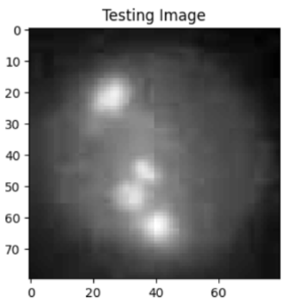
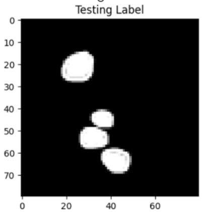
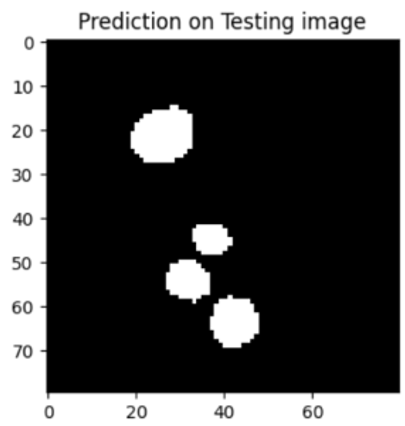

# Stress Granule Segmentation with U-Net and Cross-Validation

## Overview

This project focuses on the segmentation of stress granules (SGs) from biological images using U-Net, a deep learning architecture commonly used for image segmentation tasks. The goal is to accurately classify pixels and provide quantitative analysis of SGs while ensuring model robustness and reliability using cross-validation techniques.

## Problem Statement

Manual image analysis, particularly in experimental biology, is time-consuming and repetitive. To address this, we employ deep learning-based image segmentation techniques that allow for efficient visual analysis and quantification of experimental data.

## Approach

1. **Data Preprocessing** :

* Image and mask datasets are resized and normalized for consistent input dimensions.
* Images are normalized, while masks are rescaled to a range of 0-1.

2. **Model Architecture** :

* A U-Net model is designed for pixel-wise classification.
* The model uses a combination of convolutional, dropout, and upsampling layers to capture intricate image features.

3. **Training** :

* The dataset is split into training, validation, and testing subsets.
* Cross-validation (K-Fold) is applied to ensure generalization and robustness.
* The model is trained using `binary_crossentropy` loss and metrics like accuracy, IoU, precision, recall, and AUC.

4. **Evaluation** :

* Performance is assessed using metrics like Intersection over Union (IoU), precision, recall, and accuracy.
* Model predictions are visualized alongside ground truth images to compare segmentation performance.

## Model

The U-Net architecture consists of:

* Contracting path: Captures image features at different levels using convolution and pooling layers.
* Expansive path: Reconstructs the segmented image using upsampling and concatenation layers.

The model is trained using the `Adam` optimizer with a `binary_crossentropy` loss function and various metrics to assess performance.

## Results

* **Cross-Validation** : K-Fold cross-validation is applied to ensure that the model is robust and generalizes well across different data splits.
* **Performance** : Metrics such as IoU, accuracy, precision, recall, and AUC are used to evaluate the performance of the model.
* **Visualizations** : Example predictions are visualized and compared with the ground truth masks.

## Example Output

Predictions on test images:

| Image                                          | Label                                          | Prediction                                     |
| ---------------------------------------------- | ---------------------------------------------- | ---------------------------------------------- |
|  |  |  |

## Future Work

* **Hyperparameter Tuning** : Experiment with different optimizers and loss functions.
* **Data Augmentation** : Enhance model generalization by augmenting the image dataset.
* **Advanced Architectures** : Explore advanced models like ResU-Net or attention-based U-Nets for improved performance.
